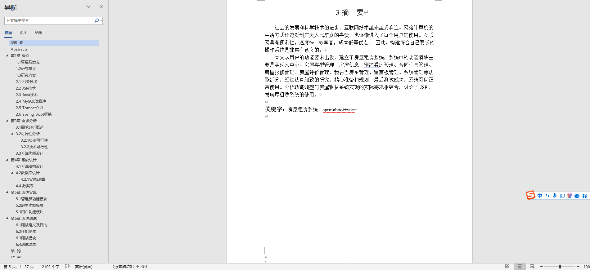
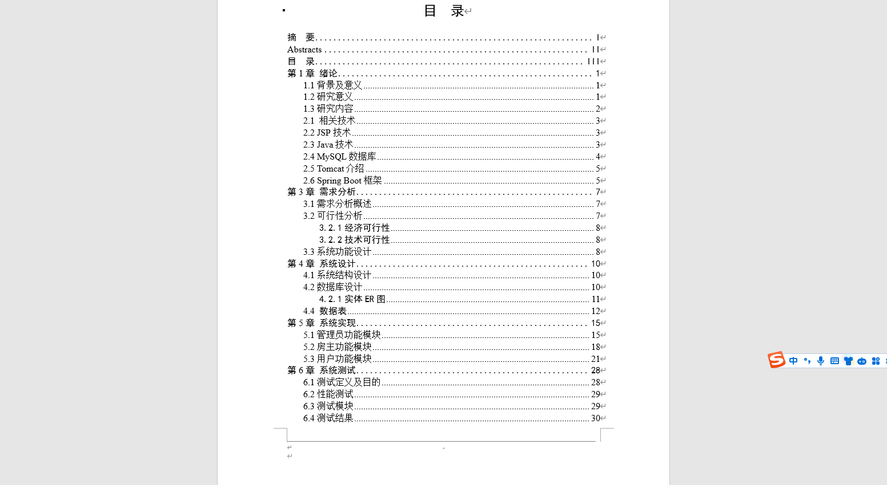
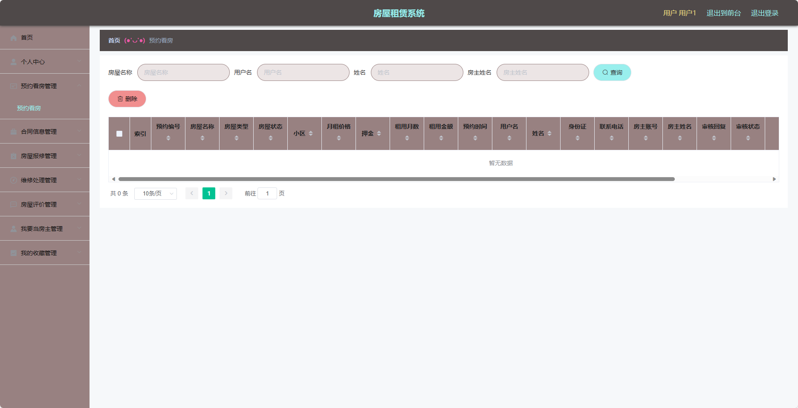
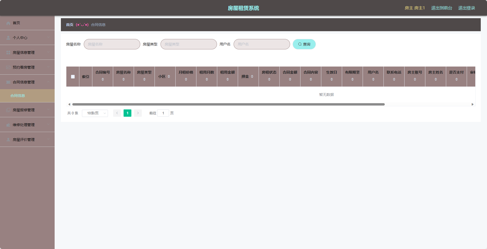
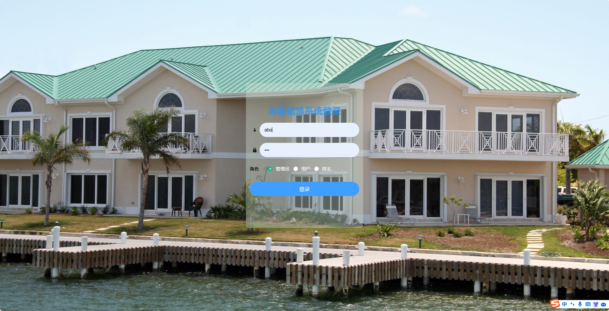
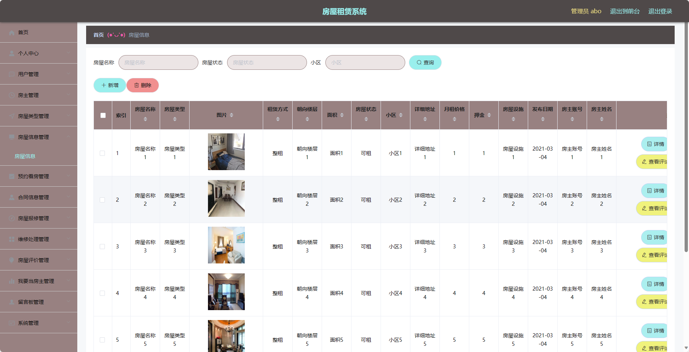

基于SpringBoot的房屋租赁系统（程序+论文）
=
- 完整代码获取地址：从戎源码网 ([https://armycodes.com/](https://armycodes.com/))
- 作者微信：19941326836  QQ：952045282 
- 承接计算机毕业设计、Java毕业设计、Python毕业设计、深度学习、机器学习
- 选题+开题报告+任务书+程序定制+安装调试+论文+答辩ppt 一条龙服务
- 所有选题地址https://github.com/nature924/allProject

一、项目介绍
---
基于Spring Boot框架实现的房屋租赁系统，系统包含两种角色：管理员、用户,系统分为前台和后台两大模块，主要功能如下。
### 【前台】：
- 首页：展示房屋租赁系统的核心内容。
- 房屋信息：展示可租赁的房屋信息。
- 我要当房主：提供用户提交房屋出租信息的功能。
- 公告信息：发布系统的公告信息。
- 留言反馈：提供用户留言和反馈的功能。
- 个人中心：用户可以在个人中心管理自己的个人信息。

### 【后台】：
### 【管理员】：
- 个人中心：管理员可以查看和编辑个人信息，包括修改密码等。
- 用户管理：管理员可以管理系统的用户账号，包括添加、编辑和删除用户。
- 房主管理：管理员可以管理系统的房主账号，包括添加、编辑和删除房主。
- 房屋类型管理：管理员可以管理系统的房屋类型，包括添加、编辑和删除房屋类型。
- 房屋信息管理：管理员可以管理系统的房屋信息，包括添加、编辑和删除房屋信息。
- 预约看房管理：管理员可以管理用户的预约看房信息，包括确认预约、取消预约等操作。
- 合同信息管理：管理员可以管理用户的合同信息，包括生成合同、终止合同等操作。
- 房屋报修管理：管理员可以管理用户的房屋报修信息，包括处理报修、记录维修进度等。
- 维修处理管理：管理员可以管理房屋维修的处理情况，包括派遣维修人员等操作。
- 房屋评价管理：管理员可以管理用户对房屋的评价信息，包括查看评价、回复评价等。
- 我要当房主管理：管理员可以管理用户提交的房主申请，包括审核申请、记录房主信息等。
- 留言板管理：管理员可以管理用户的留言信息，包括回复留言、删除留言等操作。
- 系统管理：管理员可以管理系统的其他配置信息，包括系统公告、参数设置等。

### 【用户】：
- 个人中心：用户可以查看和编辑个人信息，包括修改密码等。
- 预约看房管理：用户可以预约看房，包括选择房屋、填写联系方式等。
- 合同信息管理：用户可以查看和管理自己的合同信息，包括终止合同、查看合同详情等。
- 房屋报修管理：用户可以提交房屋报修申请，包括填写报修信息、上传照片等。
- 维修处理管理：用户可以查看和跟踪房屋维修的处理进度，包括查看维修状态、评价维修人员等。
- 房屋评价管理：用户可以对租赁的房屋进行评价，包括评分、撰写评价等。
- 我要当房主管理：用户可以申请成为房主，包括填写房屋信息、上传照片等。
- 我的收藏管理：用户可以管理自己收藏的房屋信息，包括查看收藏、取消收藏等操作。

### 【房主】：
- 个人中心：房主可以查看和编辑个人信息，包括修改密码等。
- 房屋信息管理：房主可以管理自己的房屋信息，包括添加、编辑和删除房屋信息。
- 预约看房管理：房主可以查看用户的预约看房信息，包括确认预约、拒绝预约等操作。
- 合同信息管理：房主可以查看和管理与用户的合同信息，包括查看合同详情、终止合同等。
- 房屋报修管理：房主可以查看和处理用户的房屋报修申请，包括指派维修人员、记录维修进度等。
- 维修处理管理：房主可以查看和跟踪房屋维修的处理进度，包括查看维修状态、评价维修人员等。
- 房屋评价管理：房主可以查看用户对自己房屋的评价信息，包括回复评价等操作。

二、项目技术
---
- 编程语言：Java
- 数据库：MySQL
- 项目管理工具：Maven
- 前端技术：VUE、HTML、Jquery、Bootstrap
- 后端技术：Spring、SpringMVC、MyBatis

三、运行环境
---
- 操作系统：Windows、macOS都可以
- JDK版本：JDK1.8以上都可以
- 开发工具：IDEA、Ecplise、Myecplise都可以
- 数据库: MySQL5.7以上都可以
- Tomcat：任意版本都可以
- Maven：任意版本都可以

四、运行截图
---
### 论文截图：

### 程序截图：

